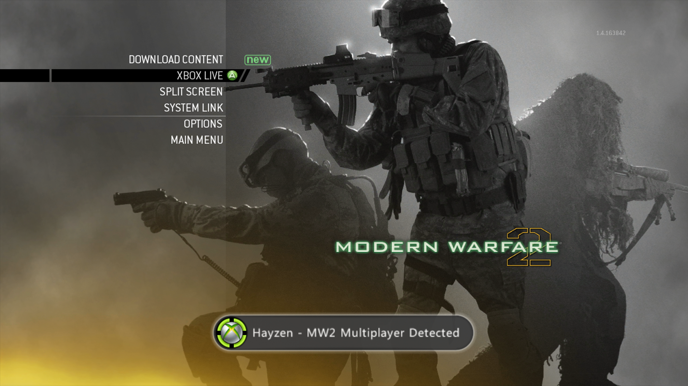
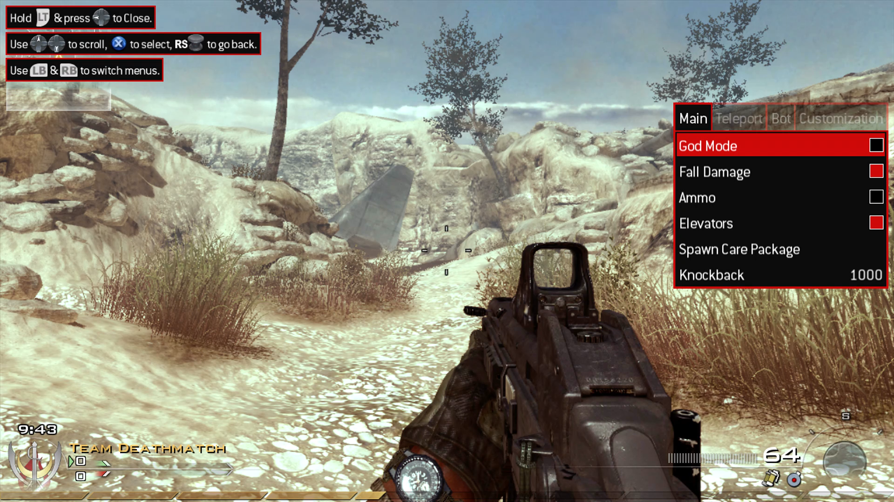

# Hayzen

Hayzen is a dynamic library (DLL) for RGH/Jtag/Devkit Xbox 360s that contains mods for different games.

## Features

### Game detection



### A mod menu



#### Supported games

-   Call of Duty: Modern Warfare 2 - TU9 Multiplayer (latest version)
-   Call of Duty: Modern Warfare 2 - TU9 Special Ops (latest version)
-   Call of Duty: Modern Warfare 2 - Pre Alpha 482 Multiplayer
-   Call of Duty: Modern Warfare 2 - Pre Alpha 482 Special Ops
-   Call of Duty: Modern Warfare 3 - TU24 Multiplayer (latest version)
-   Call of Duty: Modern Warfare 3 - TU24 Special Ops (latest version)
-   Call of Duty: Future Warfare (NX1)

### Running debug builds

This feature is enabled by default (can be disabled from the Settings tab of the mod menu) and is persistent across reboots. It allows you to run XEX files built in debug mode or EXE files that can normally only run on Devkits, so no need for RGLoader anymore. More info [here](docs/debug-builds.md).

## Installation

### Normal use

-   Download the latest binary from the [releases](https://github.com/ClementDreptin/Hayzen/releases).
-   Load the module either by setting it as a Dashlaunch plugin or by using an external tool to load modules, such as [ModuleLoader](https://github.com/ClementDreptin/ModuleLoader) :wink:.

### Development

Clone the repository and the submodule:

```
git clone --recursive https://github.com/ClementDreptin/Hayzen.git
```

#### Requirements

-   Having the Xbox 360 Software Development Kit (XDK) installed.
-   Xbox 360 Neighborhood set up with your RGH/Jtag/Devkit registered as the default console (only necessary if you wan't to deploy to your console automatically).

#### Visual Studio 2010

Open `Hayzen.sln` in Visual Studio.

#### Visual Studio 2022 (or any environment)

You can't build with the 64-bit version of MSBuild so you'll need to run the 32-bit version manually. Open PowerShell (which can be done in `View > Terminal` in Visual Studio) and run the following command:

```PS1
# Create an alias to the 32-bit version of MSBuild named msbuild
# The default installation path of VS2022 is C:\Program Files\Microsoft Visual Studio\2022\Community
Set-Alias msbuild "<path_vs2022>\MSBuild\Current\Bin\MSBuild.exe"
```

Now run `msbuild` to compile the plugin and deploy it to your console.

#### About the deployment

If you don't want to deploy to your console automatically, you can exclude the deployment from the build in `Configuration Properties > Console Deployment > General > Excluded From Build` in Visual Studio, or by adding `<ExcludedFromBuild>true</ExcludedFromBuild>` to `Project.ItemDefinitionGroup.Deploy` in `Hayzen.vcxproj`.

If you still want to deploy but are not satisfied with the deploy location on the console, you can change it in `Configuration Properties > Console Deployment > Copy To Hard Drive > Deployment Root` in Visual Studio, or by changing `Project.PropertyGroup.RemoteRoot` in `Hayzen.vcxproj`.

#### About the debug configuration

The `Debug` build configuration **does NOT** use the debug runtime nor the default debug libraries, this is due to extra checks being done in the debug version of XAPI (`xapilibd.lib`) that trigger a kernel exception (`stop code 0xf4: CRITICAL_OBJECT_TERMINATION`) when trying to execute code that lives in a non-executable memory page. This happens when hooking a function and trying to jump back to its original code, which lives in the `.data` segment of the plugin while the hook is active.

Because we are not linking to the default debug libraries, the debug build has to use the release builds of [XexUtils](https://github.com/ClementDreptin/XexUtils) and [mINI](https://github.com/ClementDreptin/Hayzen/tree/master/deps/mINI).
