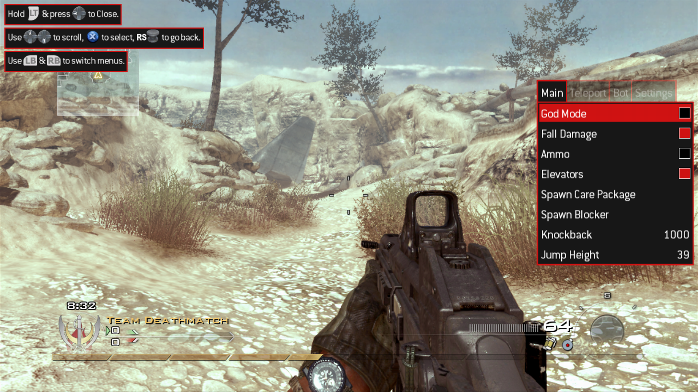

# Hayzen

Hayzen is a dynamic library (DLL) for RGH/Jtag/Devkit Xbox 360s that contains mods for different games.

## Features

### Game detection


### A mod menu



#### Supported games

-   Call of Duty: Modern Warfare 2 - TU9 Multiplayer (latest version)
-   Call of Duty: Modern Warfare 2 - TU9 Special Ops (latest version)
-   Call of Duty: Modern Warfare 2 - Pre Alpha 482 Multiplayer
-   Call of Duty: Modern Warfare 2 - Pre Alpha 482 Special Ops
-   Call of Duty: Modern Warfare 3 - TU24 Multiplayer (latest version)
-   Call of Duty: Modern Warfare 3 - TU24 Special Ops (latest version)
-   Call of Duty: Future Warfare (NX1)

### Running debug builds

This feature is enabled by default (can be disabled from the Settings tab of the mod menu) and is persistent across reboots. It allows you to run XEX files built in debug mode or EXE files that can normally only run on Devkits, so no need for RGLoader anymore.

**Note**: It is recommended **NOT** to rename the plugin XEX file. Or if you do, make sure the name is 11-characters long **AT MOST!**, otherwise loading debug builds won't work. This is due to technical limitations.

The following games were tested

#### Call of Duty 4 - Pre Alpha 253

| File                   | Status             | Notes      |
| ---------------------- | ------------------ | ---------- |
| CoD3MP.exe             | :heavy_check_mark: |            |
| CoD3SP.exe             | :heavy_check_mark: |            |
| CoD3SP_fast_server.exe | :heavy_check_mark: |            |
| CoD3SP_profile.exe     | :x:                | Zone error |

#### Call of Duty 4 - Pre Alpha 290

| File                   | Status             | Notes      |
| ---------------------- | ------------------ | ---------- |
| CoD3MP.exe             | :heavy_check_mark: |            |
| CoD3SP.exe             | :heavy_check_mark: |            |
| CoD3SP_fast_server.exe | :heavy_check_mark: |            |
| CoD3SP_profile.exe     | :x:                | Zone error |

#### Call of Duty 4 - Pre Alpha 328

| File                   | Status             | Notes |
| ---------------------- | ------------------ | ----- |
| cod3mp.exe             | :heavy_check_mark: |       |
| cod3sp.exe             | :heavy_check_mark: |       |
| CoD3SP_fast_server.exe | :heavy_check_mark: |       |
| CoD3SP_profile.exe     | :heavy_check_mark: |       |

#### Call of Duty Modern Warfare 2 - Pre Alpha 482

| File                    | Status             | Notes |
| ----------------------- | ------------------ | ----- |
| 1-iw4sp.exe             | :heavy_check_mark: |       |
| 2-iw4mp.exe             | :heavy_check_mark: |       |
| 3-iw4sp_fast_server.exe | :heavy_check_mark: |       |
| 4-iw4sp_demo.exe        | :heavy_check_mark: |       |
| 5-iw4mp_demo.exe        | :heavy_check_mark: |       |
| 6-iw4mp_fast_server.exe | :heavy_check_mark: |       |
| 7-iw4sp_demo_replay.exe | :heavy_check_mark: |       |
| 8-iw4mp_beta.exe        | :heavy_check_mark: |       |

#### Call of Duty Modern Warfare 3 - Debug 419

| File                    | Status             | Notes |
| ----------------------- | ------------------ | ----- |
| 1-iw5sp.exe             | :heavy_check_mark: |       |
| 2-iw5mp.exe             | :heavy_check_mark: |       |
| 3-iw5sp_fast_server.exe | :heavy_check_mark: |       |
| 4-iw5sp_demo.exe        | :heavy_check_mark: |       |
| 5-iw5mp_demo.exe        | :heavy_check_mark: |       |
| 6-iw5mp_fast_server.exe | :heavy_check_mark: |       |
| 7-iw5sp_demo_replay.exe | :heavy_check_mark: |       |
| 9-iw5sp_screenshot.exe  | :heavy_check_mark: |       |
| a-iw5mp_screenshot.exe  | :heavy_check_mark: |       |

#### Call of Duty Future Warfare (NX1)

| File                     | Status             | Notes       |
| ------------------------ | ------------------ | ----------- |
| 0-Convoy Test 1_5.mp.xex | :heavy_check_mark: |             |
| 0-Nightly MP maps.mp.xex | :x:                | Fatal crash |
| 0-Nightly SP maps.sp.xex | :heavy_check_mark: |             |
| 1-nx1sp.xex              | :x:                | Fatal crash |
| 2-nx1mp.xex              | :x:                | Fatal crash |
| 3-nx1sp_fast_server.xex  | :x:                | Fatal crash |
| 4-nx1sp_demo.xex         | :x:                | Fatal crash |
| 5-nx1mp_demo.xex         | :heavy_check_mark: |             |
| 6-nx1mp_fast_server.xex  | :x:                | Fatal crash |

**Note**: You must **NOT** be signed into a profile to start the MW3 EXEs, otherwise it will display an error or crash because you have DLC content (at least Erosion, Aground and Terminal) installed for a different version of the game. Just start the EXE and then connect to a profile after.

## Installation

### Normal use

-   Download the latest binary from the [releases](https://github.com/ClementDreptin/Hayzen/releases).
-   Load the module either by setting it as a Dashlaunch plugin or by using an external tool to load modules, such as [ModuleLoader](https://github.com/ClementDreptin/ModuleLoader) :wink:.

### Development

Clone the repository and the submodule:

```
git clone --recursive https://github.com/ClementDreptin/Hayzen.git
```

#### Requirements

-   Having the Xbox 360 Software Development Kit (XDK) installed.
-   Xbox 360 Neighborhood set up with your RGH/Jtag/Devkit registered as the default console (only necessary if you wan't to deploy to your console automatically).

#### Visual Studio 2019

Open `Hayzen.sln` in Visual Studio and build it.

#### Visual Studio 2022

You can't build with the 64-bit version of MSBuild so you'll need to run the 32-bit version manually. Open a developer PowerShell in Visual Studio (`View > Terminal`) and run the following command:

```PS1
# Create an alias to the 32-bit version of MSBuild named msbuild
# The default installation path of VS2022 is C:\Program Files\Microsoft Visual Studio\2022\Community
Set-Alias msbuild "<path_vs2022>\MSBuild\Current\Bin\MSBuild.exe"
```

Now run `msbuild` to compile the plugin and deploy it to your console.

#### Notes

If you don't want to deploy to your console automatically, you can exclude the deployment from the build in `Configuration Properties > Console Deployment > General > Excluded From Build`.
If you still want to deploy but are not satisfied with the deploy location on the console, you can change it in `Configuration Properties > Console Deployment > Copy To Hard Drive > Deployment Root`.
